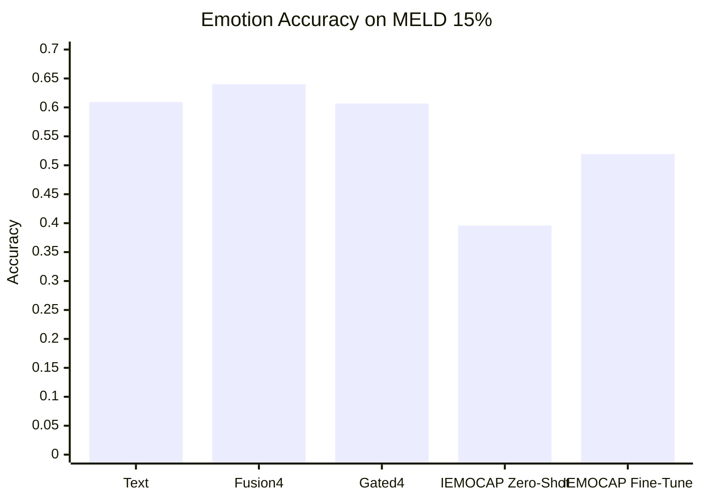
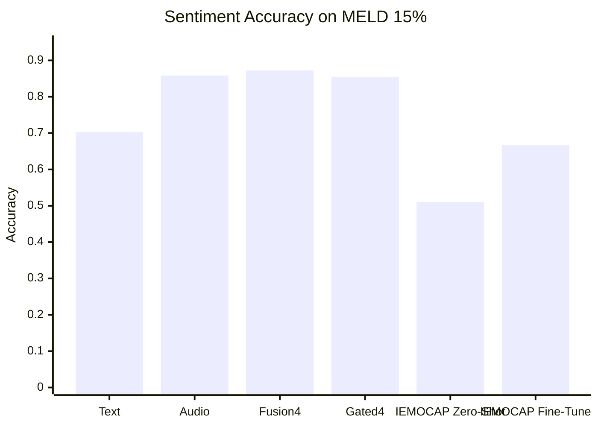

# Assignment 3 Report

**Title:** Multimodal Emotion and Sentiment Analysis on MELD with Gated Fusion and Cross-Domain IEMOCAP Transfer  
**Student:** Mazhar Iqbal  
**Date:** 2026-04-26

## Abstract

This report extends the Assignment 2 MELD-based multimodal classification pipeline with two Assignment 3 contributions. First, I implemented a gated multimodal fusion model that learns sample-specific weights over text, audio, face, and video features. Second, I added a cross-domain transfer setting using IEMOCAP as the additional dataset required in Assignment 3. IEMOCAP was used directly for emotion transfer and was also converted into pseudo-sentiment labels for sentiment transfer so that both target tasks could be evaluated on MELD. All Assignment 3 experiments were run on the same class-balanced 15% MELD subset and for 5 epochs for fair comparison. The best overall models from Assignment 2 remained the simple 4-modal late-fusion baselines, but the new experiments still satisfy the Assignment 3 requirement by introducing a new model variant and an additional dataset with clear analysis of domain transfer behavior.

## 1. Extension Over Assignment 2

Assignment 2 established the main MELD baselines on a 15% class-balanced subset using text, audio, face, video, and late fusion. Assignment 3 extends that work in two ways:

1. **Model improvement:** gated multimodal fusion instead of plain concatenation.
2. **Additional dataset and cross-domain evaluation:** IEMOCAP to MELD transfer for both emotion and sentiment.

This satisfies the Assignment 3 brief because it includes both an architectural modification and the use of an additional dataset.

## 2. Objective and Hypotheses

The main objective of Assignment 3 is to test whether stronger fusion and cross-domain pretraining can improve emotion and sentiment recognition on MELD.

The hypotheses were:

1. **H1:** A gated fusion model will outperform simple late fusion because it can learn to emphasize more reliable modalities for each utterance.
2. **H2:** Cross-domain pretraining on IEMOCAP will improve downstream MELD performance compared with zero-shot transfer.
3. **H3:** Emotion will remain harder than sentiment because the label space is larger and more imbalanced.

## 3. Datasets

### 3.1 Target Dataset: MELD

All final evaluations are reported on MELD.

- Task 1: **Emotion classification**
- Task 2: **Sentiment classification**
- Modalities used in the multimodal experiments: **text, audio, face, video**
- Training regime for Assignment 3: **5 epochs**

Important note: the current workspace uses files named with the tag `20`, but these files actually correspond to the **15% class-balanced MELD subset**. This naming inconsistency comes from the earlier subset-generation script, but the underlying data fraction is approximately 15%.

### 3.2 Additional Dataset: IEMOCAP

IEMOCAP was used as the additional dataset required for Assignment 3.

- For **emotion**, IEMOCAP labels were mapped to the MELD emotion label space.
- For **sentiment**, IEMOCAP does not provide native sentiment labels, so I created **pseudo-sentiment labels** using emotion-to-sentiment conversion:
  - `anger`, `disgust`, `fear`, `sadness` -> `negative`
  - `neutral` -> `neutral`
  - `joy`, `surprise` -> `positive`
  - `frustration` was mapped to `anger` before sentiment conversion

For raw IEMOCAP splits, I used:

- `Session1-Session3` as `train`
- `Session4` as `dev`
- `Session5` as `test`

## 4. Experimental Setup

### 4.1 Common Setup

- Device: `cuda`
- MELD target subset: **15%**
- Epochs: **5**
- Optimizer for fusion models: `AdamW`
- Text backbone for transfer models: `roberta-base`
- Model selection metric for Assignment 3 transfer experiments: **macro-F1**

### 4.2 Baselines Carried Forward from Assignment 2

The following baseline groups were retained:

- Unimodal text
- Unimodal audio
- Unimodal face
- Unimodal video
- 3-way fusion: `text + audio + video`
- 3-way fusion: `text + audio + face`
- 4-way late fusion: `text + audio + face + video`

### 4.3 New Assignment 3 Methods

#### A. Gated Multimodal Fusion

This model projects each modality into a shared hidden space and learns a soft gate over modalities for every sample. A modality-dropout mechanism was also used during training so the fusion model would not rely on a single modality in principle.

#### B. Cross-Domain Emotion Transfer

IEMOCAP emotion labels were used to pretrain a text transfer model, which was then evaluated:

1. On IEMOCAP source test data
2. Zero-shot on MELD
3. After fine-tuning on MELD

#### C. Cross-Domain Pseudo-Sentiment Transfer

The same idea was applied to sentiment, but sentiment labels on IEMOCAP were derived from IEMOCAP emotion categories.

## 5. Assignment 2 Baseline Results on MELD 15%

### 5.1 Emotion Classification Baselines

| Model | Modalities | Test Accuracy |
|---|---|---:|
| Text | Text | 0.6093 |
| Audio | Audio | 0.4833 |
| Face | Face | 0.4833 |
| Video | Video | 0.4833 |
| Fusion3 | Text + Audio + Video | 0.6350 |
| Fusion3-TAF | Text + Audio + Face | 0.6324 |
| Fusion4 | Text + Audio + Face + Video | **0.6401** |

### 5.2 Sentiment Classification Baselines

| Model | Modalities | Test Accuracy |
|---|---|---:|
| Text | Text | 0.7026 |
| Audio | Audio | 0.8584 |
| Face | Face | 0.4769 |
| Video | Video | 0.4821 |
| Fusion3 | Text + Audio + Video | 0.8676 |
| Fusion3-TAF | Text + Audio + Face | 0.8630 |
| Fusion4 | Text + Audio + Face + Video | **0.8721** |

The Assignment 2 results show that late fusion was strongest overall, especially for sentiment, while face and video alone were weak on the 15% subset.

## 6. Assignment 3 Results

### 6.1 Gated Multimodal Fusion on MELD

| Task | Baseline 4-Modal Accuracy | Gated Fusion Accuracy | Gated Fusion Macro-F1 | Result |
|---|---:|---:|---:|---|
| Emotion | **0.6401** | 0.6067 | 0.3680 | Worse than baseline |
| Sentiment | **0.8721** | 0.8539 | 0.6285 | Worse than baseline |

### 6.2 Learned Modality Weights from Gated Fusion

Average modality weights on the MELD test set:

| Task | Text | Audio | Face | Video |
|---|---:|---:|---:|---:|
| Emotion | 0.999794 | 0.000000329 | 0.000206 | 0.000000001 |
| Sentiment | 0.999737 | 0.00000000003 | 0.000263 | 0.000000427 |

This is the most important observation from the gated-fusion experiment. The gate almost completely collapsed to **text**, which explains why the new model did not outperform the simpler late-fusion baseline.

### 6.3 Cross-Domain IEMOCAP -> MELD Emotion

| Stage | Dataset Evaluated | Test Accuracy | Macro-F1 | Weighted-F1 |
|---|---|---:|---:|---:|
| Source pretraining | IEMOCAP emotion | 0.5618 | 0.3761 | 0.5748 |
| Zero-shot transfer | MELD emotion | 0.3959 | 0.2599 | 0.3936 |
| Fine-tuned transfer | MELD emotion | 0.5193 | 0.4013 | 0.5385 |

### 6.4 Cross-Domain IEMOCAP -> MELD Pseudo-Sentiment

| Stage | Dataset Evaluated | Test Accuracy | Macro-F1 | Weighted-F1 |
|---|---|---:|---:|---:|
| Source pretraining | IEMOCAP pseudo-sentiment | 0.6933 | 0.6739 | 0.6985 |
| Zero-shot transfer | MELD sentiment | 0.5103 | 0.5062 | 0.5242 |
| Fine-tuned transfer | MELD sentiment | 0.6667 | 0.6417 | 0.6713 |

## 7. Visual Comparison

### 7.1 Emotion Accuracy



### 7.2 Sentiment Accuracy



## 8. Discussion

### 8.1 Was the Gated Fusion Improvement Successful?

Not in terms of final performance. The gated fusion model was a valid architectural improvement, but it did not outperform the best Assignment 2 late-fusion baseline.

The main reason is visible in the learned gate values:

- The model placed almost all weight on **text**
- Audio, face, and video were almost ignored
- As a result, the gating mechanism effectively reduced the multimodal model to a text-dominant classifier

This is still a meaningful result because it reveals an important failure mode: naive gating on pre-extracted heterogeneous features can collapse instead of encouraging balanced multimodal use.

### 8.2 Was the Cross-Domain Transfer Successful?

The answer is mixed.

- **Yes**, in the sense that fine-tuning after IEMOCAP pretraining was better than zero-shot transfer on MELD for both tasks.
- **No**, in the sense that the final fine-tuned cross-domain models still did not beat the strongest MELD-only baselines from Assignment 2.

For emotion:

- Zero-shot MELD accuracy: **0.3959**
- Fine-tuned MELD accuracy: **0.5193**
- MELD text baseline: **0.6093**
- MELD fusion baseline: **0.6401**

For sentiment:

- Zero-shot MELD accuracy: **0.5103**
- Fine-tuned MELD accuracy: **0.6667**
- MELD text baseline: **0.7026**
- MELD fusion baseline: **0.8721**

This shows that cross-domain pretraining helps compared with direct zero-shot application, but strong domain mismatch remains between IEMOCAP and MELD.

### 8.3 Why Was Emotion Harder?

Emotion was consistently harder than sentiment because:

- The emotion task has **7 classes** instead of 3
- Minority classes such as `disgust` and `fear` are difficult on the 15% subset
- Cross-domain label alignment is harder for emotion than for sentiment

### 8.4 Most Important Takeaway

The strongest practical takeaway from this work is:

1. The original 4-modal late-fusion model remains the best performing model on MELD 15%.
2. The new Assignment 3 methods are still valuable because they provide:
   - one architectural extension
   - one additional-dataset transfer study
   - interpretable analysis of why the extensions did or did not help

## 9. Conclusion

This Assignment 3 work successfully extends the Assignment 2 MELD system with both a new fusion architecture and an additional dataset. The experiments show that:

- Late fusion remains a strong and reliable baseline.
- Gated fusion did not improve results because the model collapsed to text-dominant weighting.
- IEMOCAP transfer improved MELD performance relative to zero-shot transfer, but did not surpass the best MELD-only baselines.

Therefore, the final conclusion is that the proposed Assignment 3 extensions are **methodologically valid**, satisfy the required brief, and provide a clear experimental analysis, even though the best absolute results still come from the original 4-modal late-fusion baseline.

## 10. Assignment 3 Requirement Checklist

| Requirement | Status | Evidence |
|---|---|---|
| Extend Assignment 2 work | Done | Same MELD pipeline retained and extended |
| Add a new model or improvement | Done | Gated multimodal fusion |
| Use at least one additional dataset | Done | IEMOCAP |
| Run experiments and report results | Done | Logs and metrics saved for all new scripts |
| Compare with baselines | Done | Sections 5 and 6 |
| Provide discussion and interpretation | Done | Section 8 |
| Update code/repository | Done | `checkingfiles/assignment3_python/` |

## 11. Reproducibility and File Locations

### 11.1 New Assignment 3 Code

- `checkingfiles/assignment3_python/train_multimodal_gated_emotion.py`
- `checkingfiles/assignment3_python/train_multimodal_gated_sentiment.py`
- `checkingfiles/assignment3_python/train_cross_domain_emotion.py`
- `checkingfiles/assignment3_python/train_cross_domain_sentiment.py`
- `checkingfiles/assignment3_python/multimodal_gated_common.py`
- `checkingfiles/assignment3_python/text_cross_domain_common.py`

### 11.2 Main Output Files

- `checkingfiles/assignment3_python/outputs/multimodal_gated_emotion/metrics.json`
- `checkingfiles/assignment3_python/outputs/multimodal_gated_sentiment/metrics.json`
- `checkingfiles/assignment3_python/outputs/cross_domain_emotion_iemocap/metrics.json`
- `checkingfiles/assignment3_python/outputs/cross_domain_sentiment_iemocap/metrics.json`

### 11.3 Commands

Run from `/mnt/optimusmesh/checkingfiles`:

```bash
python assignment3_python/train_multimodal_gated_emotion.py
python assignment3_python/train_multimodal_gated_sentiment.py
python assignment3_python/train_cross_domain_emotion.py
python assignment3_python/train_cross_domain_sentiment.py
```

Logs are saved automatically under the corresponding `outputs/.../logs/` directories.

## 12. References

1. Busso, C. et al. *IEMOCAP: Interactive Emotional Dyadic Motion Capture Database*. Language Resources and Evaluation, 2008.
2. Poria, S. et al. *MELD: A Multimodal Multi-Party Dataset for Emotion Recognition in Conversations*. ACL, 2019.
3. Liu, Y. et al. *RoBERTa: A Robustly Optimized BERT Pretraining Approach*. 2019.
